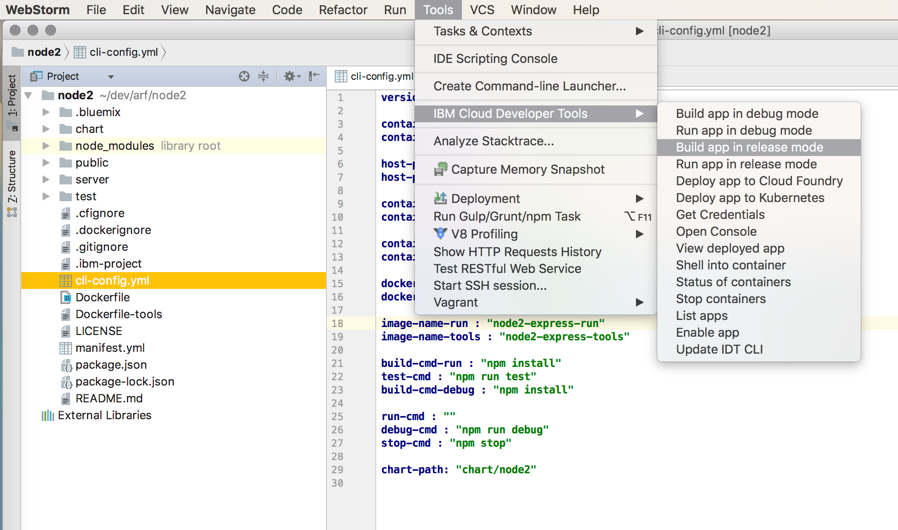

# IBM Cloud Developer Tools CLI - Helper for Jetbrains IDEs

### Table of Contents
* [Summary](#summary)
* [Installation](#installation)
* [Usage](#usage)
* [Uninstall](#uninstall)
* [Feedback](#feedback)

## Summary

This settings JAR file can be imported into any of the [Jetbrains](https://www.jetbrains.com) based IDEs -- IntelliJ, WebStorm, Android Studio, etc -- that will provide new menu entries to call IDT actions from directly within the IDE.

Notice: This helper is provided "as-is". IBM does not explicitly endorse, nor support 3rd party products. Although, we will attempt to answer questions through our Slack channel, because we want you to succeed and be happy.

## Installation

Note: You must have previously [installed](../README.md) the IBM Developer Tools CLI.

1. Download the [idt-jetbrains-settings.jar](https://github.com/IBM-Cloud/ibm-cloud-developer-tools/raw/master/jetbrains/idt-jetbrains-settings.jar) file
    - Note: Do NOT click the actual jar file listed above to download.  This will not work.  Use the link shown.
1. Open your preferred [Jetbrains IDE](https://www.jetbrains.com)
1. Select `File` > `Import Settings`, then locate and pick the downloaded *idt-jetbrains-settings.jar* file.

Once complete, there will be a new "IBM Cloud Developer Tools" entry under the following menus:
- Main "Tools" menu
- Editor context (right-click) menu
- Project context menu
- Search results

## Usage

You can either start with an existing server-side app, and `Enable` it for the IBM Cloud, or use the IDT CLI to `Create` a new app from a StarterKit (`bx dev create`). Once you have your app's project, open it in your JetBrains IDE.

If you have a generic server-side app, select `Tools` > `IBM Cloud Developer Tools` > `Enable app for IBM Cloud`.  This will check for, and add all required files to enable you to build the app locally, as well as deploy it to IBM Cloud using either as a Cloud Foundry app, or within a Kubernetes cluster.

Develop your cloud native app as normal, using the basic build/run/deploy actions from the IDT menu. If you need to perform actions that are not in the menu, simply open the Terminal tab and enter the desired commands manually.

For more information, see the [IBM Cloud Developer Tools documentation](https://console.bluemix.net/docs/cloudnative/dev_cli.html).

## Uninstall

If you wish to remove the IBM Developer Tools CLI helper, simply go into `Preferences` > `Tools` > `External Tools`, and then select and delete (minus sign) each entry under the "IBM Cloud Developer Tools" group.  The group itself is removed once the final entry is deleted.

## Feedback

We can be reached in the following ways. We encourage and welcome all feedback and suggestions
- [IBM Cloud Tech Slack](https://slack-invite-ibm-cloud-tech.mybluemix.net/): Find us on the `#developer-tools` channel
- [IBM Cloud Developer Tools GitHub repo](https://github.com/IBM-Cloud/ibm-cloud-developer-tools): Use to file any issues specific to this Jetbrains helper

